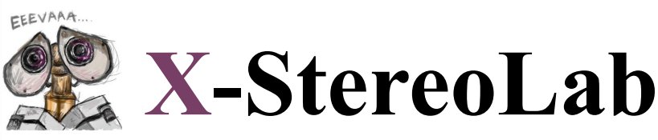
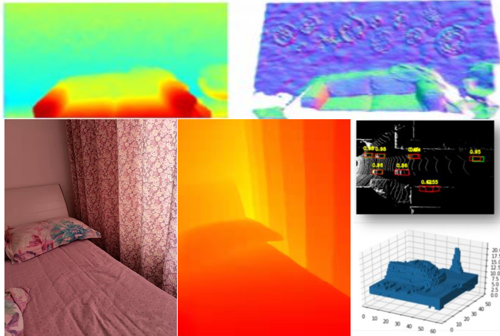
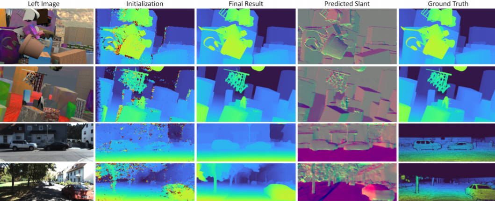
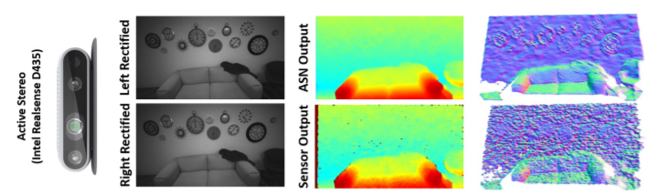

<div align="left">
 
</div>
X-StereoLab is an open source stereo matching and stereo 3D object detection toolbox based on PyTorch.

## News: We released the codebase v0.0.0.
* matching and detection model  result.
<div align="center">
 
</div>


* GOOGLE HITNET model pytorch model will be released.
<div align="center">
 
</div>

* GOOGLE HITNET model pytorch  KITTI2015 submission: http://www.cvlibs.net/datasets/kitti/eval_scene_flow_detail.php?benchmark=stereo&result=226494ba5559e9f5f46bdbd681d1564fee78409e
  ranking 145 with 80GMAC


### Requirements
All the codes are tested in the following environment:
* Ubuntu 16.04
* Python 3.7
* PyTorch 1.1.0 or 1.2.0 or 1.3.0
* Torchvision 0.2.2 or 0.4.1

### Installation 

(1) Clone this repository.
```
git clone git@github.com:meteorshowers/X-StereoLab.git && cd X-StereoLab
```

(2) Setup Python environment.
```
conda activate -n xstereolab
pip install -r requirements.txt --user

## conda deactivate xstereolab
```

<!-- (3) Compile the rotated IoU library (for 3D detection). 
```
cd X-stereoLab/utils/rotate_iou && bash compile.sh & cd ../../../
```

(4) Compile and install X-StereoLab library (for 3D detection).
```
# the following will install the lib with symbolic links, so that
# you can modify the file if you want and won't need to re-build it.
python3 setup.py build develop --user
``` -->

### Data Preparation

(1) Please download the KITTI dataset.
```
ln -s /path/to/KITTI_DATA_PATH ./data/kitti/
ln -s /path/to/OUTPUT_PATH ./outputs/
```


### Multi-GPU Training

The training scripts support [multi-processing distributed training](https://github.com/pytorch/examples/tree/master/imagenet), which is much faster than the typical PyTorch DataParallel interface.
```
python3 tools/train_net_disp.py --cfg ./configs/config_xxx.py --savemodel ./outputs/MODEL_NAME -btrain 4 -d 0-3 --multiprocessing-distributed
```
The training models, configuration and logs will be saved in the model folder.

To load some pretrained model, you can run
```
python3 tools/train_net_disp.py --cfg xxx/config.py --loadmodel ./outputs/MODEL_NAMEx --start_epoch xxx --savemodel ./outputs/MODEL_NAME -btrain 4 -d 0-3 --multiprocessing-distributed
```
If you want to continue training from some epochs, just set the cfg, loadmodel and start_epoch to the respective model path.

Besides, you can start a tensorboard session by
```
tensorboard --logdir=./outputs/MODEL_NAME/tensorboard --port=6666
```
and visualize your training process by accessing https://localhost:6666 on your browser.

### Inference and Evaluation

on working ...

### stereo matching Performance and Model Zoo

<!-- We provide several pretrained models for our experiments. -->

<table>
    <thead>
        <tr>
            <th>Methods</th>
            <th>Epochs</th>
            <!-- <th>Inference Time(s/im)</th> -->
            <th>Train Mem (GB/Img)</th>
            <th>Test Mem (GB/Img)</th>
            <th>EPE</th>
            <th>D1-all</th>
            <th>Models</th>
        </tr>
    </thead>
    <tbody>
        <tr>
            <td>HITNET (kitti)</td>
            <td>4200</td>
            <td></td>
            <td></td>
            <td></td>
            <td>2.43%</td>
            <td><a href=> GoogleDrive </a></td>
        </tr>
            <tr>
            <td>HITNET (sceneflow)</td>
            <td>200</td>
            <td></td>
            <td></td>
            <td>0.65</td>
            <td></td>
            <td><a href=> GoogleDrive </a></td>
        </tr>
          <tr>
            <td>stereonet (sceneflow)</td>
            <td>20</td>
            <td></td>
            <td></td>
            <td>1.10</td>
            <td></td>
            <td><a href=> GoogleDrive </a></td>
        </tr>
          <tr>
            <td>ActiveStereoNet</td>
            <td>10</td>
            <td></td>
            <td></td>
            <td></td>
            <td></td>
            <td><a href=> GoogleDrive </a></td>
        </tr>      
        <tr>
            <td>SOS</td>
            <td rowspan=2></td>
            <td rowspan=2> </td>
            <td rowspan=2></td>
            <td></td>
            <td></td>
            <td rowspan=2> </a></td>
        </tr>
        
    </tbody>
</table>

### stereo 3D detection Performance and Model Zoo
#### PLUME: Efficient 3D Object Detection from Stereo Images

<table>
    <thead>
        <tr>
            <th>Methods</th>
            <th>Epochs</th>
            <!-- <th>Inference Time(s/im)</th> -->
            <th>Train Mem (GB/Img)</th>
            <th>Test Mem (GB/Img)</th>
            <th>3D BEV AP (Ours small plume)</th>
            <th>3D BEV AP (Paper small plume)</th>
        </tr>
    </thead>
    <tbody>
        <tr>
            <td>PLUME</td>
            <td></td>
            <td></td>
            <td></td>
            <td>72.9 / 62.5 / 56.9</td>
            <td>74.4 / 61.7 / 55.8</td>
        </tr>
    </tbody>
</table>


### Video Demo

We provide a video demo for showing the result of X-StereoLab. Here we show the predicted disparity map of activastereonet.

<p align="center"> <a href="https://www.youtube.com/watch?v=pqKZs1b1b0Y"></a> </p>

### TODO List
- [x] Multiprocessing GPU training
- [x] TensorboardX
- [x] Reduce training GPU memory usage
- [x] eval and test code
- [ ] Result visualization
- [ ] Still in progress


### Citations
If you find our work useful in your research, please consider citing:
```
@misc{XStereoLab2021,
    title={{X-StereoLab} stereo matching and stereo 3D object detection toolbox},
    author={X-StereoLab Contributors},
    howpublished = {\url{https://github.com/meteorshowers/X-StereoLab}},
    year={2021}
}
* refercence[2] 
@article{tankovich2020hitnet,
  title={HITNet: Hierarchical Iterative Tile Refinement Network for Real-time Stereo Matching},
  author={Tankovich, Vladimir and H{\"a}ne, Christian and Fanello, Sean and Zhang, Yinda and Izadi, Shahram and Bouaziz, Sofien},
  journal={arXiv preprint arXiv:2007.12140},
  year={2020}
}

* refercence[3] 
@inproceedings{tankovich2018sos,
  title={Sos: Stereo matching in o (1) with slanted support windows},
  author={Tankovich, Vladimir and Schoenberg, Michael and Fanello, Sean Ryan and Kowdle, Adarsh and Rhemann, Christoph and Dzitsiuk, Maksym and Schmidt, Mirko and Valentin, Julien and Izadi, Shahram},
  booktitle={2018 IEEE/RSJ International Conference on Intelligent Robots and Systems (IROS)},
  pages={6782--6789},
  year={2018},
  organization={IEEE}
}

```


## Others contributors

<table border="0">
  <tbody>
    <tr align="center" >
      <!-- <td>
        ​ <a href="https://github.com/shenweichen"></a><br>
        ​ <a href="https://github.com/shenweichen">Shen Weichen</a> ​
        <p>
        Alibaba Group  </p>​
      </td> -->
      <td>
         <a href="https://github.com/vtankovich"></a><br>
         <a href="https://github.com/vtankovich">vtankovich</a> ​
        <p>GOOGLE  </p>​
      </td>
     <td>
         <a href="https://github.com/mileyan"></a><br>
         <a href="https://github.com/mileyan">Yan Wang</a> ​
        <p>Waymo  </p>​
      </td>     
    </tr>
  </tbody>
</table>


### Acknowledgment

* Thanks to  <a href="https://github.com/samehkhamis"> SamehKhamis (NVIDIA) 

### License
The code is released under the Creative Commons Attribution-NonCommercial-ShareAlike 4.0 International Public License for NonCommercial use only. Any commercial use should get formal permission first.

### Contact
If you have any questions or suggestions about this repo, please feel free to contact me (xuanyili.edu@gmail.com).
Wechat:
<table border="0">
  <tbody>
    <tr align="center" >
      <!-- <td>
        ​ <a href="https://github.com/shenweichen"></a><br>
        ​ <a href="https://github.com/shenweichen">Shen Weichen</a> ​
        <p>
        Alibaba Group  </p>​
      </td> -->
      <td>
         <a href="https://github.com/meteorshowers"></a><br>
         <a href="https://github.com/meteorshowers">XUANYILI</a> ​
        <p>  </p>​
      </td>
    </tr>
  </tbody>
</table>
